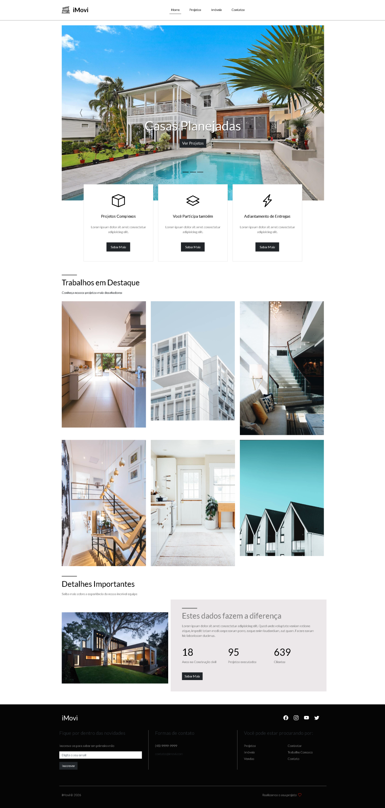

# 🏠 iMovi - Landing Page



## 🌐 Acesse o projeto

👉 [Clique aqui para visualizar o site](https://anaclarissi.github.io/13-imovi/)

---

## 📖 Sobre o projeto

O **iMovi** é uma landing page desenvolvida com foco em apresentação de projetos imobiliários.
O site foi construído com **HTML**, **CSS** e **Bootstrap**, priorizando um design moderno, responsivo e organizado.

A proposta é simular o site de uma empresa do ramo de construção civil, destacando serviços, projetos e informações institucionais.

---

## 🚀 Tecnologias utilizadas

* HTML5
* CSS3
* Bootstrap 5
* Bootstrap Icons
* Google Fonts (Lato e Raleway)

---

## 🎯 Funcionalidades

* ✅ Navbar responsiva com menu mobile
* ✅ Carousel (slider) com destaque de projetos
* ✅ Seção de mini banners informativos
* ✅ Grid de projetos em destaque
* ✅ Seção institucional com dados da empresa
* ✅ Footer completo com newsletter e links úteis
* ✅ Layout totalmente responsivo

---

## 📸 Preview

> Caso a imagem não apareça, verifique se o arquivo está em:
> `/src/img/preview.png`

---

## 📂 Como rodar o projeto

```bash
# Clone o repositório
git clone https://github.com/anaClarissi/13-imovi.git

# Acesse a pasta
cd 13-imovi

# Abra o arquivo index.html no navegador
```

---

## 📬 Contato

* 💼 LinkedIn: https://www.linkedin.com/in/anaclarissi
* 💻 GitHub: https://github.com/anaClarissi
* 📧 Email: [seuemail@email.com](mailto:anaclarissicruz@email.com)

---

## ✨ Melhorias futuras

* Integração com backend
* Sistema de cadastro de imóveis
* Filtro de busca de projetos
* Animações mais avançadas

---

## 📌 Status do projeto

🚧 Em desenvolvimento / aprimoramento contínuo

---

## 💙 Autora

Desenvolvido por **Ana Clarissi**
